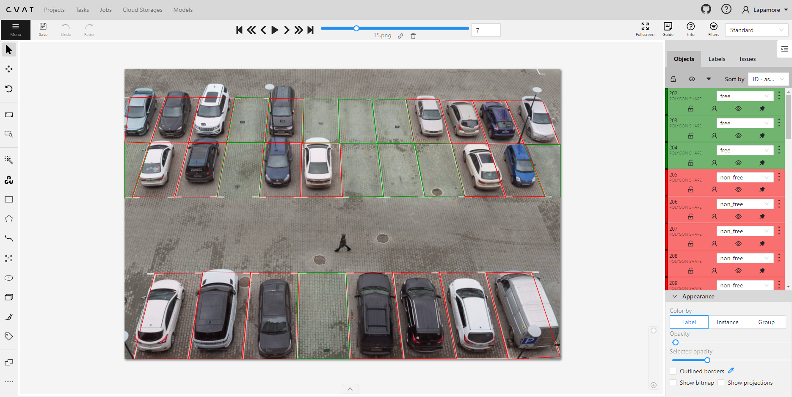
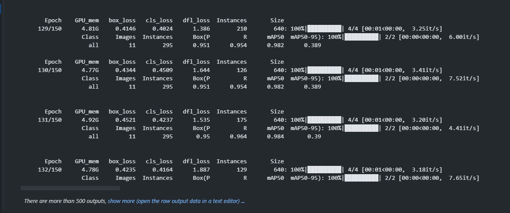
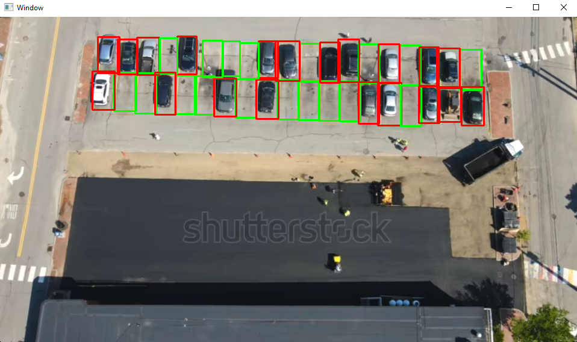

# YOLO Parking Space Monitor

### Описание
Данный проект создан для тестирования YOLO-OBB. Модель обучена автоматически распознавать свободные и занятые места на парковке с целью улучшения и оптимизации системы парковки.

## План последовательных действий
1. **Разметка фотографий на CVAT:** В разделе разметки проекта на CVAT были загружены фотографии парковок, а затем проведена разметка свободных и занятых парковочных мест.

    
2. **Обучение модели YOLO-OBB:** Для обучения модели YOLO-OBB были использованы размеченные данные с CVAT.

    
3. **Написание скрипта визуализации:** Написан маленький скрипт на языке Python с использованием библиотеки OpenCV для визуализации работы обученной модели на тестовых изображениях парковок.

    

### Особенности
- Использование YOLO для точного и быстрого обнаружения мест на парковке.
- Обучение модели на наборе данных, содержащем изображения свободных и занятых парковочных мест.
- Визуализация результатов работы модели.

Этот проект предоставляет простой и эффективный способ оценки возможностей YOLO- модели в области распознавания парковочных мест.
